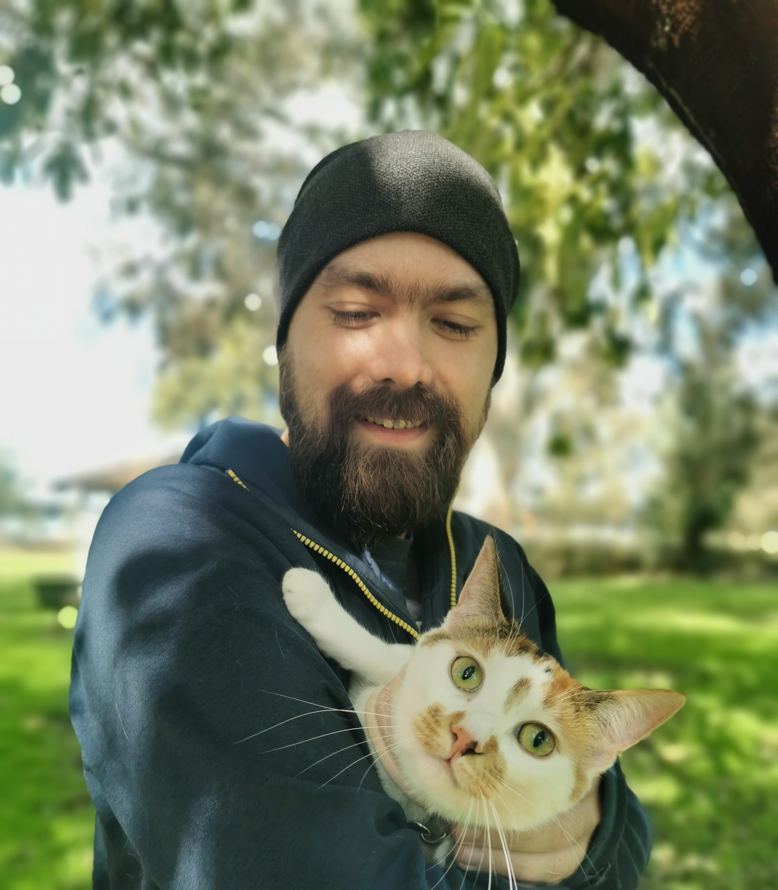

I am a Research Associate in the [Maths and Stats Department](https://www.uwa.edu.au/schools/physics-mathematics-computing/mathematics-and-stats) at the University of Western Australia.  
In January 2025, I will be moving to [University of Galway](https://www.universityofgalway.ie/science/school-of-maths/)  as a postdoctoral reasearcher.

My research is in the field of Algebra, more specifically, Group Theory. That includes questions about finite groups, their representations and related combinatorial stractures. 

This page is under development, so there is not much to see yet. But you can chack out my [CV](antonCV.pdf)!
